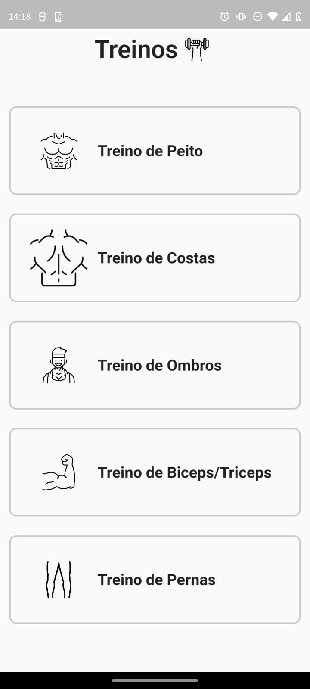

# Projeto Academia

#### Esse projeto está sendo desenvolvido como uma forma de estudar Flutter e C# ele ainda vai envolver o cadastro dos exercicios, leitura, alteração e deletação dos mesmos. Além de usar a ferramenta do Firebase Cloud Storage que permite manipular imagens

 

## Funcionalidades Principais
 - Cadastro de Exercícos

## Tecnologias Utilizadas
 - Flutter
 - C# [Link Repositório](https://github.com/guipavezzi/GymProjectAPI)
 - Firebase Cloud Storage

 

## Instalação do Flutter

Siga as instruções na [documentação do flutter](https://docs.flutter.dev/get-started/install) para fazer a instalação corretamente

Se preferir também existe um [tutorial para a instalação flutter](https://www.youtube.com/watch?v=dpppZ9ySJSY)

Se quiser também usar um emulador recomendo um [tutorial configurar o emulador](https://www.youtube.com/watch?v=gNYNvHUSW1s)

## Instalação do C#
Para o desenvolvimento C# foi usado o Visual Studio versão Community 2022 e .Net 6.0. 
- Link para a [instalação do Visual Studio Community 2022](https://visualstudio.microsoft.com/vs/community/)
- Link para a [instalação do .NET 6.0](https://dotnet.microsoft.com/download/dotnet/6.0)
- Consulte a [documentação do .NET](https://docs.microsoft.com/dotnet/) para obter mais informações sobre o uso e recursos do framework.

## Instalação e uso do Firebase

Consulte a [documentação do firebase](https://firebase.google.com/docs/storage?hl=pt-br) para saber como instalar e como utilizar a ferramenta do Cloud Storage no seu aplicativo além de outras ferramentas disponibilizadas 

 

### Imagem do Aplicativo

